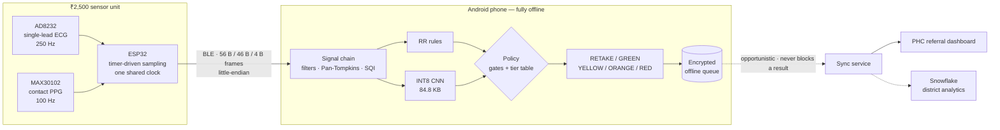
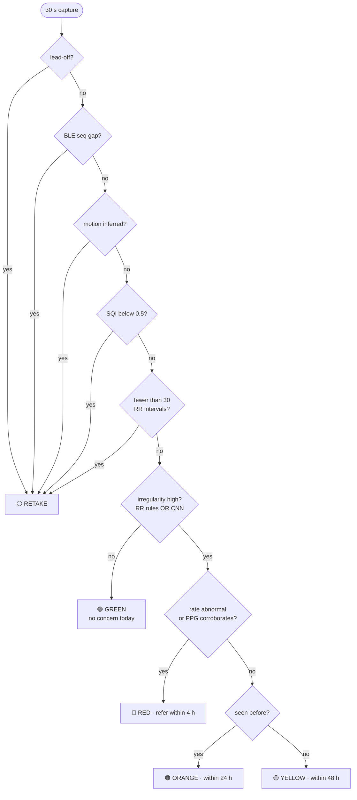
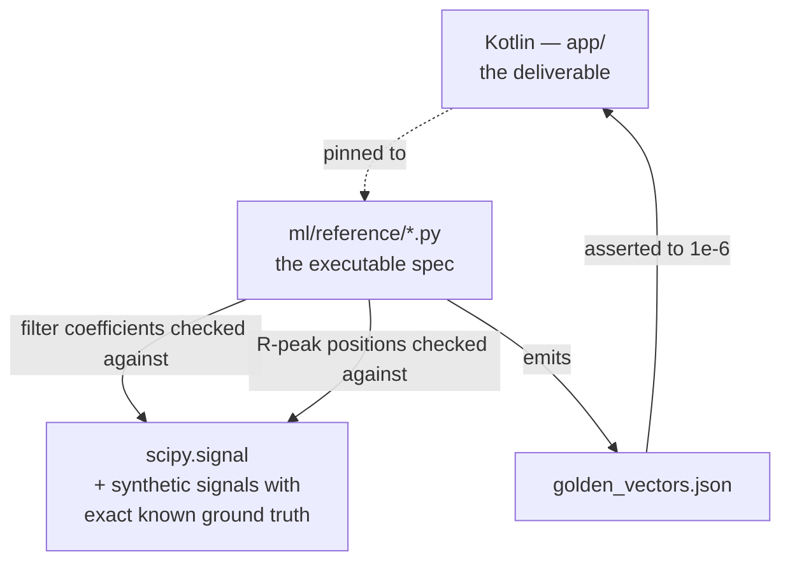

<div align="center">

# ArogyaX

**An offline atrial-fibrillation screening and triage layer for doorstep healthcare.**

A health worker's Android phone, a ~₹2,500 single-lead ECG unit, and no internet connection.

[](#verification--how-this-project-knows-it-works)
[](#measured-performance)
[](#the-model)
[](#measured-performance)
[](#offline-is-the-product-not-a-mode)

</div>

---

## The problem

Tamil Nadu's *Makkalai Thedi Maruthuvam* scheme sends health workers door to door. Atrial
fibrillation is a leading cause of stroke, it is often **completely asymptomatic**, and it is
detectable from a 30-second single-lead ECG — but only if the equipment reaches the patient's
doorstep, works without a network, and never wastes a clinician's time on a signal it should
have refused to score.

ArogyaX is the layer that decides **who needs to be seen, and how soon**.

> [!IMPORTANT]
> **It never displays a diagnosis.** The output is referral urgency — a colour and a
> timeframe — and nothing else. A health worker is not a cardiologist, and a screening
> tool that says "atrial fibrillation" on a phone screen has quietly promoted itself to
> one. The strings "atrial fibrillation", "AF", and "arrhythmia" are structurally absent
> from every worker-facing surface.

---

## What it refuses to do

These are safety constraints, not preferences. Code that violates one is wrong even if it works.

| # | Constraint | Why it exists |
|---|---|---|
| 1 | **Never display a diagnosis** | Output is referral urgency only |
| 2 | **Never score a bad signal** | Refusing to answer is a feature, not a failure |
| 3 | **A dropped BLE frame invalidates the window** | Concatenating across a gap fabricates a short RR interval, which looks *exactly* like AF |
| 4 | **Offline is the product, not a mode** | Every screening completes with the radio off |
| 5 | **No PII leaves the device** | Only a salted `patientPseudoId` — no name, phone, or Aadhaar |
| 6 | **PPG escalates, never reassures** | It can raise a tier, never lower one |
| 7 | **No model-generated text, ever** | Every worker-facing string comes from a static, reviewable table |
| 8 | **Every reported metric is measured** | Anything unmeasured is labelled a target, not a result |

Constraint 3 is the one that matters most and is easiest to get wrong. A BLE glitch must
never become a referral.

---

## How it works



The sample rate is **timer-driven, not `delay()`-paced**. Jitter corrupts RR intervals, and RR
intervals *are* the AF signal.

---

## The decision path

Gates run before scoring, in a fixed order. The first match wins — and four of the five
possible outcomes are reached without ever consulting a model.



> [!NOTE]
> **RETAKE is a first-class outcome, not an error.** A screening tool that always produces a
> tier is a screening tool that produces wrong ones.

---

## Measured performance

CinC 2017, **record-disjoint** test split — 1,364 windows, 124 AF (9.1%).

> [!WARNING]
> Record-disjoint is **not** patient-disjoint. PhysioNet publishes no subject IDs for this
> dataset, so we cannot claim otherwise, and we don't.

| Detector | Sensitivity | Specificity | PPV | F1 |
|---|---|---|---|---|
| RR rules only | `0.750` ███████▌░░ | `0.848` ████████▍░ | 0.330 | 0.458 |
| INT8 CNN only | `0.911` █████████░ | `0.804` ████████░░ | 0.317 | 0.471 |
| **Rules OR CNN** *(ships)* | **`0.952`** █████████▌ | `0.706` ███████░░░ | 0.244 | 0.389 |

**AUC** 0.9336 (INT8) vs 0.9359 (FP32) · **PR-AUC** 0.629 · **inference** 0.26 ms median, 0.29 ms p95

### Why OR'd rather than averaged

Screening biases toward sensitivity: a missed AF becomes a stroke, a false alarm becomes an
inconvenience. The two detectors agree only **76%** of the time — the CNN catches **25** AF
windows the rules miss, the rules catch **5** the CNN misses. That disagreement is the whole
argument for running both.

### What this means in the field

At the scheme's real prevalence of 5.1%, per 100 people screened:

```
🔴 true AF flagged      4.9   ████▉
⚠️  false alarms        27.9   ███████████████████████████▉
❌ AF missed            0.2   ▏
```

Roughly **1 in 7 referrals is real**. That is the honest cost of a 0.952-sensitivity screen,
and it is a deliberate trade: the alternative is missing strokes.

<details>
<summary><b>Project history — how the specificity got here</b></summary>

The RR rules gate previously fired on ~50% of healthy people (Sp 0.497). The logistic centres
were literature-derived placeholders that had never been fitted to data. Refitting against
**MIT-BIH AFDB** (23 records, record-disjoint, 5-fold CV: Sp 0.702 → 0.911) and confirming on
the independent CinC 2017 split (Sp 0.497 → **0.848**) gave cross-dataset agreement rather than
an AFDB-only artefact.

The combined OR moved from Sp 0.429 / ~54 false alarms per 100 to Sp 0.706 / 27.9.

</details>

---

## The model

A 5-block strided 1D CNN over the **raw 30 s waveform** at 250 Hz — deliberately not a
leaderboard architecture.

| Decision | Choice | Reasoning |
|---|---|---|
| Input | Raw waveform, 7500 samples | Sees morphology the RR rules are structurally blind to, so the OR is additive rather than two correlated copies |
| Negative class | Normal **and** *Other rhythm* | Ectopy raises RMSSD/pNN50/entropy just as AF does — separating AF from *other* irregular rhythms is the CNN's one clinical contribution |
| Training data | CinC 2017, conditioned + resampled to 250 Hz | Train what you deploy: same filter chain, same sample rate, or the model learns one signal and is shown another |
| Quantisation | Full-integer INT8 | 84.8 KB, runs on a ₹6,000 handset |

> [!CAUTION]
> **Quantisation collapses which operating points exist.** The INT8 output is a single `int8`,
> so the test set lands on ~97 distinct scores in steps of 1/256, against 1,364 for FP32.
> Roughly a dozen operating points exist *anywhere* in Se ∈ [0.80, 0.98]. A threshold fitted on
> FP32 and carried over to INT8 is not a small approximation — it is a different classifier.
>
> This project caught a live instance of exactly that failure inside its own artifacts
> directory: a seed-0 retrain moved the correctly-fitted threshold from 0.007812 to **0.1875**,
> a 24× change for a near-identical operating point.

---

## Verification — how this project knows it works

**Every signal module has a line-for-line Python twin, and the Python is the verified side.**



The Python validates the algorithms independently, then emits golden vectors the Kotlin tests
assert against to **1e-6**. The two implementations are pinned to each other, and the pair is
pinned to scipy and to ground truth.

> If you change a DSP constant, change it in both, then regenerate the vectors.
> The tests fail loudly when they drift — that is the point.

| Suite | Checks | Covers |
|---|---|---|
| `validate_dsp.py` | 30 | Filters, Pan–Tompkins, RR features, SQI |
| `validate_policy.py` | 35 | Tier decision table and gate ordering |
| `validate_ppg.py` | 28 | PPG peaks, perfusion index, ECG/PPG fusion |
| `validate_record.py` | 47 | Record schema v4, pseudo-ID, sync state machine, backoff |
| `validate_history.py` | 29 | Repeat visits, clinician outcomes, training-label eligibility |
| `server` (`npm test`) | 49 | Sync service, auth, idempotency, CORS — no database required |
| Kotlin (`./gradlew test`) | 71 ×2 variants | Golden vectors, PPG/fusion, record/patient history, sync engine + client, audio playback orchestration |

**288 checks pass with zero setup.** One more (the live-server sync test) is `@Ignore`d by
default — it needs Atlas credentials, not hardware, so it stays out of the count above.

---

## Demo integrity

The stage demo replays a **real, labelled AF recording** through the identical on-device
pipeline, because atrial fibrillation cannot be induced in a healthy teammate. We say so out
loud. Replayed data is never presented as a live capture.

The bundled trace is PhysioNet/CinC 2017 record **A02501**, label `A` (AF), resampled
300 → 250 Hz and *not otherwise touched* — the app's own SQI and filter chain run on it exactly
as they would on a live ESP32 capture.

| Gate | Value | Threshold | Margin |
|---|---|---|---|
| RR intervals | 49 | ≥ 30 | **+63%** |
| SQI | 0.9655 | ≥ 0.50 | **+93%** |
| Irregularity | 0.9431 | ≥ 0.50 | **+89%** |
| Mean HR | 99.0 bpm | 50–120 band | **+30%** |

> [!NOTE]
> The first trace shipped here cleared the 30-interval gate by **exactly zero** — one missed
> R peak would have turned the flagship demo into a RETAKE. `export_replay_trace.py` now
> refuses to emit any trace with less than 25% headroom on every gate. See
> [`attic/README.md`](attic/README.md).

---

## Repository layout

| Path | Status |
|---|---|
| `contracts/` | ✅ **Locked.** BLE wire format, record schema v4, tier policy, model I/O, PPG. Single source of truth — read before writing code. |
| `ml/` | ✅ **Built.** Preprocessing, training, INT8 calibration, evaluation, Python reference. |
| `android/` | 🚧 **Under active port.** Signal chain, PPG/fusion, record/patient history, `SignalSource`/replay, sync engine + client, and audio playback orchestration done. `./gradlew test` green from a bare shell (71 tests, 1 `@Ignore`d live-server test). |
| `server/` | ✅ **Built and tested.** MongoDB sync service, 49 tests plus a live end-to-end run. |
| `server/scripts/export_to_snowflake.js` | ✅ **Full pipeline proven live** — MongoDB Atlas → Snowflake, verified by reading the same record back from both systems. |
| `dashboard/` | ✅ **Built.** Static referral queue + risk map, no CDN. |
| `firmware/` | ✅ **Compiled, flashed, boot-verified** on real hardware. |
| `app/lib/` | 📦 **Superseded.** The Python-verified Dart the Kotlin port is built against, module by module. |
| `attic/` | 🗄️ **Retired, not deleted.** Superseded assets and pre-existing files, with the reasons. |
| Tamil strings + spoken audio | 📝 **Drafted, unreviewed.** All 39 worker-facing strings and 239 real ElevenLabs clips exist; nothing has had native-speaker or clinician review yet. |
| App UI, BLE transport | ⬜ **Not written.** |

---

## Quick start

None of this needs a phone or a sensor. Only the ML pipeline needs the dataset,
and only the first `gradlew` run needs a network.

```bash
# Verification — pure Python, the fastest way to see the whole decision layer work
python ml/reference/validate_dsp.py       # also regenerates the golden vectors
python ml/reference/validate_policy.py
python ml/reference/validate_ppg.py
python ml/reference/validate_record.py
python ml/reference/validate_history.py

# Kotlin app tests  (needs JDK 17 on JAVA_HOME — Android Studio's bundled JBR 25 is too new)
cd android && ./gradlew test

# Sync service + dashboard — in-memory, nothing to install
cd server && npm install && DEMO=1 npm start
cd dashboard && python -m http.server 8080

# ML pipeline  (must `source ml/wsl_env.sh` first — see CLAUDE.md "Gotchas")
python ml/prepare_cinc2017.py
python ml/train_af_cnn.py --seed 0
python ml/calibrate_threshold.py
python ml/evaluate.py
```

---

## Documentation

| Document | What's in it |
|---|---|
| [`docs/PRODUCT.md`](docs/PRODUCT.md) | The product and clinical concept |
| [`CLAUDE.md`](CLAUDE.md) | Architecture, key decisions, and gotchas that cost hours |
| [`contracts/`](contracts/) | Locked interface contracts — BLE, record schema, tiers, model I/O, PPG, sync, analytics |
| [`server/README.md`](server/README.md) | Sync service, endpoints, and known gaps |

---

## On honesty

Several numbers in this README are worse than they could be if they were reported less
carefully. The split is record-disjoint and labelled as such rather than called
patient-disjoint. The false-alarm rate is stated in people, not as a specificity figure that
sounds better. Four thresholds — `kPulseDeficitBpm`, `kPerfusedBeatFractionLow`, and the two
inferred-motion gates — are marked **PROVISIONAL** because no paired ECG+PPG AF dataset and no
labelled disturbed-vs-still captures exist in this build, so they are targets rather than
results.

A screening tool that overstates itself gets trusted exactly once.

<div align="center">

---

*Built for doorstep healthcare. Offline first, honest by construction.*

</div>
