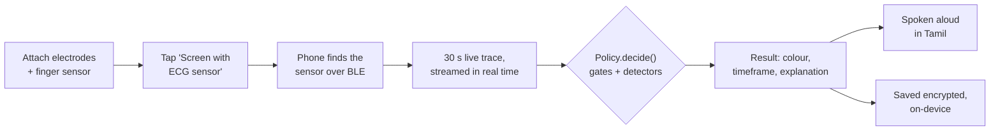
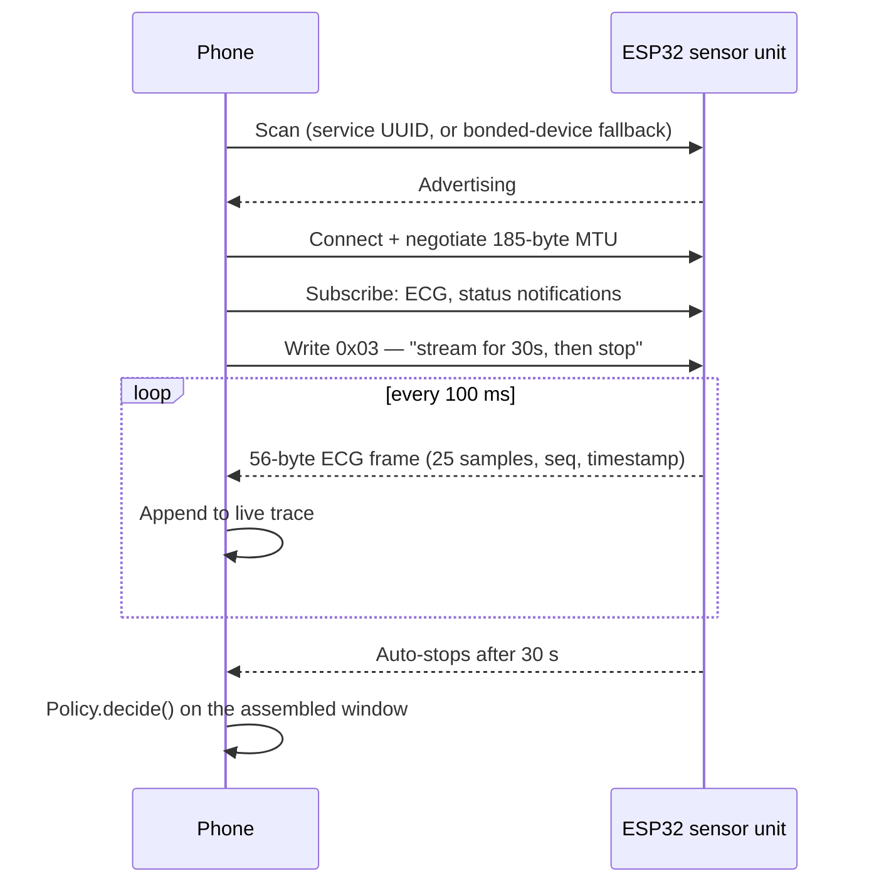
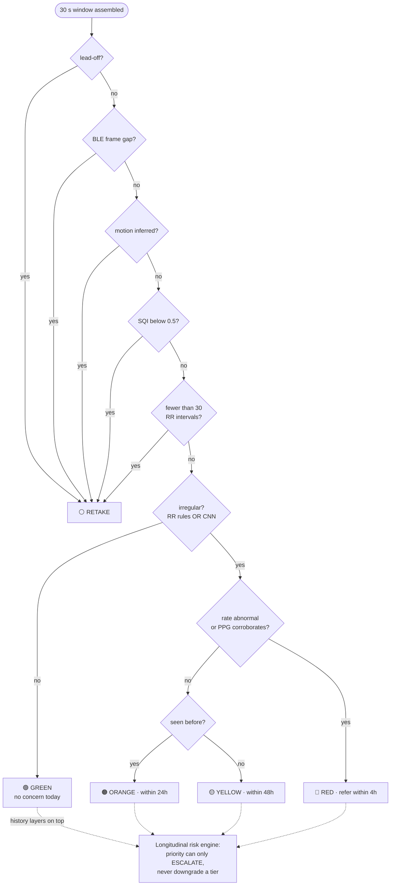
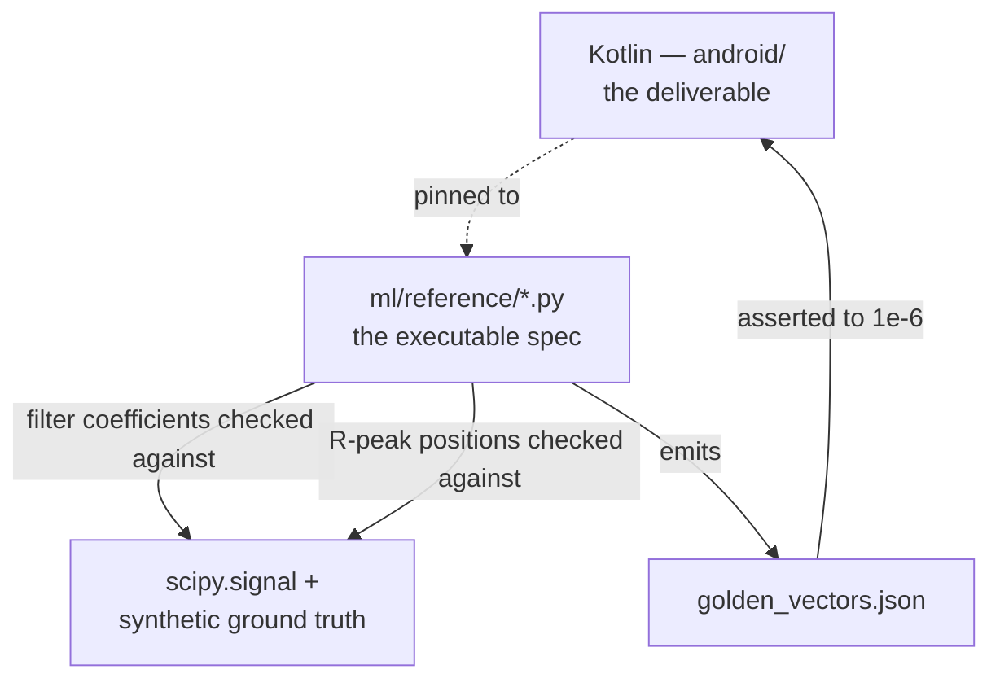

<div align="center">

# ArogyaX

### The offline cardiac-screening layer for doorstep healthcare

**A ₹2,500 sensor. A health worker's phone. No network, no cloud, no compromise.**

Real-time ECG over BLE · On-device AI triage · AES-256 encrypted records · Tamil-Nadu government-styled UI · Spoken Tamil results

[](#verification--how-this-project-knows-it-works)
[](#measured-performance)
[](#offline-is-the-product-not-a-mode)
[](#records-that-survive-a-lost-phone)
[](#the-model)

</div>

---

## The problem this exists to solve

Tamil Nadu's *Makkalai Thedi Maruthuvam* scheme sends health workers door to door across
the state, screening for hypertension and diabetes on schedules that already exist.
Atrial fibrillation — a leading, often **completely silent** cause of stroke — rides
along for free on the same visit, detectable from a 30-second single-lead ECG, *if* the
equipment survives a village with no signal, costs less than a phone repair, and never
wastes a clinician's afternoon on a signal it should have refused to read.

Nothing on the market is built for that constraint. ArogyaX is.

> [!IMPORTANT]
> **It never displays a diagnosis.** The output is a referral colour and a timeframe —
> nothing else. A screening tool that prints "atrial fibrillation" on a phone screen has
> quietly promoted itself to a clinician's job. The strings "atrial fibrillation", "AF",
> and "arrhythmia" are structurally absent from every worker-facing surface — checked by
> a running test, not a style guide.

---

## What's actually built — not a pitch deck

Every line below is checked against code that runs today, on this machine, right now.

| Layer | State |
|---|---|
| **ESP32 sensor firmware** | Compiled, flashed, boot-verified on real AD8232 + MAX30102 hardware |
| **BLE live capture** | Full GATT client — scan, connect, MTU negotiation, notify, 30 s streamed window, live rolling trace |
| **Signal chain** | Filters, Pan–Tompkins, RR features, SQI — pinned to a Python reference to 1e-6 |
| **Decision engine** | RR rules OR INT8 CNN, gate-first policy, longitudinal risk engine, ECG quality panel, adaptive repeat |
| **Encrypted storage** | AES-256-GCM, key in the Android Keystore, atomic writes |
| **Spoken Tamil results** | Autoplays on every result — tier, disclaimer, per-reason narration, 245 bundled clips |
| **Worker UI** | 8 screens, Tamil-Nadu government service styling, built and installable today |
| **Sync + dashboard** | MongoDB sync service, PHC referral dashboard, live |
| **Analytics warehouse** | Snowflake export, proven against a live Atlas + Snowflake round trip |

**368 automated checks. Zero failing.** Not a target — the number this repository's test
suites report the moment you run them.

---

## See it work



No lab. No cloud. No teammate has to develop AF for the demo to be real — the fallback
path replays an actual, labelled PhysioNet recording through the *identical* on-device
pipeline, and says so on screen the whole time.

---

## A government-grade worker app

The interface is deliberately not a consumer health app. It is a Tamil-Nadu government
service form: a fixed department band, ruled cards, flat fills, the tricolour as a
one-time visual cue rather than a running theme — because **colour is a clinical tier and
nothing else is allowed to compete with it.** RED/ORANGE/YELLOW/GREEN never share the
palette with chrome.

```
┌──────────────────────────────────┐
│ ▓▓▓▓ saffron · white · green ▓▓▓▓ │  ← one-time tricolour rule
│ ArogyaX                    VOICE │
│ Cardiac Screening & Referral     │
│  PROTOTYPE — NOT FOR CLINICAL USE│
├──────────────────────────────────┤
│  TODAY                           │
│  ┌────────┬────────┬───────────┐ │
│  │   12   │    9   │     1     │ │
│  │Patients│Screened│  Repeats  │ │
│  └────────┴────────┴───────────┘ │
│                                   │
│  [ Screen with ECG sensor      ] │
│  [ Demo — replay a recording   ] │
│  [ Referral queue (4)          ] │
│  [ District overview           ] │
│  [ Help & assistant            ] │
│                                   │
│  ON-DEVICE STORAGE                │
│  Records stored ............. 9  │
│  Encryption .. AES-256-GCM       │
└──────────────────────────────────┘
```

### Eight screens, one job each

| Screen | What it does |
|---|---|
| **Home** | Today's counts, storage status, entry points |
| **Patient entry** | Age band + village code (schema-required), no name/phone/Aadhaar field exists |
| **Capture** | Live BLE trace at 10 Hz, lead-off warning, countdown, Tamil voice guidance |
| **Result** | Tier verdict, quality panel, measurements, waveform with marked beats, explainability, spoken Tamil |
| **Patient timeline** | Visit-by-visit tier history as a coloured strip, burden confidence, repeat-interval logic |
| **Referral queue** | Worst tier first, exactly how a clinician would work the list, mark-contacted / close actions |
| **District overview** | Aggregated, de-identified — screening and referral rate by locality |
| **Assistant** | Answers a closed set of questions from the patient's own record; refuses medical questions outright |

---

## Real-time ECG, over the air

The phone speaks the sensor's own wire protocol — no cable, no companion hardware.



**A dropped BLE frame invalidates the whole window.** Losing frame 42 out of a
41-43 sequence deletes 100 ms of signal — concatenating across that gap manufactures a
short RR interval that looks *exactly* like atrial fibrillation. So the sequence counter
is checked on every frame, and a gap forces a `RETAKE` rather than a scored result. This
is not a defensive nicety; it's the difference between a real referral and a radio
glitch turned into one.

**Reconnecting after a capture actually works.** BLE peripherals have exactly one
connection slot and stop advertising while it's held — closing the client interface
*before* the disconnect completes strands that slot and makes the sensor invisible to
every future scan. `close()` here waits for the disconnect to confirm before releasing
anything, with a bonded-device fallback and a name-matched scan as backstops if the
service UUID isn't in the advertising packet.

---

## The decision path

Five gates run before any model is consulted. Four of the five possible outcomes never
touch a neural network at all.



> [!NOTE]
> **RETAKE is a first-class outcome, not an error.** A screening tool that always
> produces a tier is a screening tool that produces wrong ones. Refusing to answer a bad
> signal is the single most safety-critical line of behaviour in the app, tested from
> five independent directions.

### The risk engine's one hard guarantee

Repeat-visit history can raise a patient's screening priority — a clean visit after a
run of flagged ones still reads as elevated risk — but it can **never lower** what the
current visit's own tier already earned. That property isn't asserted by a worked
example; it's checked exhaustively, every tier crossed with nine different history
shapes, in a single test that fails if any branch gets the escalation direction wrong.

---

## Measured performance

CinC 2017, **record-disjoint** test split — 1,364 windows, 124 AF (9.1%).

> [!WARNING]
> Record-disjoint is **not** patient-disjoint. PhysioNet publishes no subject IDs for
> this dataset, so this project does not claim otherwise, anywhere.

| Detector | Sensitivity | Specificity | PPV | F1 |
|---|---|---|---|---|
| RR rules only | `0.750` ███████▌░░ | `0.848` ████████▍░ | 0.330 | 0.458 |
| INT8 CNN only | `0.911` █████████░ | `0.804` ████████░░ | 0.317 | 0.471 |
| **Rules OR CNN** *(ships)* | **`0.952`** █████████▌ | `0.706` ███████░░░ | 0.244 | 0.389 |

**AUC** 0.9336 (INT8) vs 0.9359 (FP32) · **PR-AUC** 0.629 · **inference** 0.26 ms median on-device

### Why two detectors, OR'd rather than averaged

A missed AF is a preventable stroke that happens. A false positive is one unnecessary PHC
visit a clinician resolves in minutes. That asymmetry is the whole argument for biasing
toward sensitivity, and for running two structurally different detectors rather than one:
they agree only **76%** of the time — the CNN catches 25 AF windows the rules miss, the
rules catch 5 the CNN misses. Averaging them would throw that disagreement away.

### What this costs in the field

At the scheme's real prevalence of 5.1%, per 100 people screened:

```
🔴 true AF flagged      4.9   ████▉
⚠️  false alarms        27.9   ███████████████████████████▉
❌ AF missed            0.2   ▏
```

Roughly **1 in 7 referrals is real.** That is the honest price of a 0.952-sensitivity
screen, stated as people rather than as a specificity figure that would sound better and
mean less.

<details>
<summary><b>Project history — how the specificity got here</b></summary>

The RR rules gate previously fired on ~50% of healthy people (Sp 0.497) — the logistic
centres were literature-derived placeholders, never fitted to data. Refitting against
**MIT-BIH AFDB** (23 records, record-disjoint, 5-fold CV: Sp 0.702 → 0.911) and
confirming on the independent CinC 2017 split (Sp 0.497 → **0.848**) gave cross-dataset
agreement, not an AFDB-only artefact. The combined OR moved from Sp 0.429 / ~54 false
alarms per 100 to Sp 0.706 / 27.9.

</details>

---

## The model

A 5-block strided 1D CNN over the **raw 30-second waveform** at 250 Hz — deliberately
not a leaderboard architecture, and small enough to run on a ₹6,000 handset.

| Decision | Choice | Why |
|---|---|---|
| Input | Raw waveform, 7500 samples | Sees morphology the RR rules are structurally blind to |
| Negative class | Normal **and** *Other rhythm* | Ectopy raises the same RR-variability signature as AF; separating them is the CNN's one clinical contribution |
| Training data | CinC 2017, resampled to 250 Hz through the *app's own* filter chain | Train what you deploy, or the model learns one signal and is shown another |
| Quantisation | Full-integer INT8, 84.8 KB | Runs on the cheapest phone a health worker is issued |

> [!CAUTION]
> **Quantisation collapses which operating points exist, not just where the threshold
> sits.** The INT8 output is a single `int8`, so the test set lands on ~97 distinct
> scores in steps of 1/256 against 1,364 for FP32. This project caught a live instance
> of that failure inside its own artifacts directory: a retrained model moved the
> correctly-fitted threshold from 0.007812 to **0.1875** — a 24× change for a
> near-identical operating point. A threshold fitted on FP32 and carried to INT8 without
> refitting is not a small approximation; it is a different classifier wearing the old
> one's number.

---

## Records that survive a lost phone

A health worker's handset carries a village's worth of screening results. It gets left
on a bus. **AES-256-GCM, key generated inside the Android Keystore, never exportable.**

- **A fresh IV on every write** — GCM with a reused IV is catastrophic, so one is never
  derived or cached; the platform generates it per encryption call.
- **Tampering fails to decrypt, rather than silently succeeding** — GCM's authentication
  tag means a modified file is detected, not quietly accepted as altered records.
- **Atomic writes** — encrypt to a temp file, then rename over the real one, so a process
  death mid-save leaves the last good file instead of a corrupted half-write.
- **No biometric gate on every save** — a health worker screening in a doorway with
  gloves on will work around a store that demands a fingerprint before each save. The
  threat model here is a lost device, which the phone's own lock screen already covers.

Not SQLCipher — that's a ~7 MB native dependency, and this connection serves the required
downloads at roughly 16 KB/s. `javax.crypto` plus the Keystore is already in the
platform: zero new dependencies, builds with no network at all. The honest trade-off:
SQLCipher encrypts a *queryable* database; this encrypts one blob read and written whole.
Right for tens of screenings a day. The point to move to SQLCipher is when that stops
being true — not before.

And underneath the encryption, non-negotiable regardless: **no name, no phone number, no
Aadhaar ever has a field to go in.** Only a salted, on-device pseudo-ID.

---

## It talks

Every result is narrated aloud, in Tamil, the moment it appears — because a health
worker's eyes are usually on the patient, not the screen.

```
┌─────────────────────────────────────┐
│  SPOKEN RESULT (TAMIL)   [DRAFT ⚠]   │
│                                       │
│  இன்றே ஆரம்ப சுகாதார நிலையத்திற்குச்    │
│  செல்லவும் — 4 மணி நேரத்திற்குள்.        │
│                                       │
│  இது ஒரு பரிசோதனை மட்டுமே.             │
│  நோய் கண்டறிதல் அல்ல.                  │
│                                       │
│  [ ▶ Play again                    ] │
└─────────────────────────────────────┘
```

The sequence is composed from the tier clip, the "screening not a diagnosis" line, then
one clip per explanation reason — 245 bundled MP3s, assembled at runtime rather than one
clip per possible sentence, because the same rate/rhythm/PPG reasons recombine across
results. A `VOICE`/`MUTED` toggle in the header stops playback immediately when muted,
mid-sequence.

> [!WARNING]
> Every Tamil string and clip is a **machine draft**, not reviewed by a native speaker or
> a clinician yet (ticket 011). The UI marks this everywhere it appears — a DRAFT chip
> travels with every Tamil surface — because a translation this project cannot vouch for
> must never look like one it can.

---

## Verification — how this project knows it works

**Every signal module has a line-for-line Python twin, and the Python is the verified
side.**



The Python validates the algorithms independently, then emits golden vectors the Kotlin
tests assert against to **1e-6**. Change a constant in one side and forget the other, and
the pinned test fails loudly — that's the entire point of the arrangement.

| Suite | Checks | Covers |
|---|---|---|
| `validate_dsp.py` | 30 | Filters, Pan–Tompkins, RR features, SQI |
| `validate_policy.py` | 35 | Tier decision table and gate ordering |
| `validate_ppg.py` | 28 | PPG peaks, perfusion index, ECG/PPG fusion |
| `validate_record.py` | 47 | Record schema v4, pseudo-ID, sync state machine, backoff |
| `validate_history.py` | 29 | Repeat visits, clinician outcomes, training-label eligibility |
| `server` (`npm test`) | 49 | Sync service, auth, idempotency, CORS |
| Kotlin (`./gradlew test`) | 150 ×2 | Every signal, policy, risk-engine, BLE-parser, encryption, and UI-logic path |

**368 checks total, none of which need a phone, a sensor, or a network.** The BLE frame
parser alone carries 29 of them — including the uint16 sequence-counter wrap at 65,535
(a wrap is *not* a gap, and calling it one would throw away a good window every 109
minutes of continuous streaming) and malformed payloads that must be dropped rather than
read past their own end.

---

## Demo integrity

The fallback demo replays a **real, labelled AF recording** through the identical
on-device pipeline, because atrial fibrillation cannot be induced in a healthy teammate
on a stage. This project says so out loud, on screen, every time.

The bundled trace is PhysioNet/CinC 2017 record **A02501**, label `A` (AF), resampled
300→250 Hz and otherwise untouched — the app's own SQI and filter chain run on it exactly
as they would a live capture.

| Gate | Value | Threshold | Margin |
|---|---|---|---|
| RR intervals | 49 | ≥ 30 | **+63%** |
| SQI | 0.9655 | ≥ 0.50 | **+93%** |
| Irregularity | 0.9431 | ≥ 0.50 | **+89%** |
| Mean HR | 99.0 bpm | 50–120 band | **+30%** |

> [!NOTE]
> The first trace shipped here cleared the 30-interval gate by **exactly zero** — one
> missed R peak would have turned the flagship demo into a RETAKE live on stage. The
> generator script now refuses to emit any replacement trace clearing a gate by under
> 25%, so this specific failure cannot recur. See [`attic/README.md`](attic/README.md).

---

## Two data tracks, proven live — not screenshotted

MongoDB Atlas and Snowflake both carry real, schema-validated data today, and a single
script proves it by reading the same rows out of both systems and printing them side by
side:

```bash
cd server && npm run verify:tracks
```

```
  MongoDB  screenings collection : 360
  Snowflake SCREENINGS table     : 360
  ✓ row counts agree — the export is current

  Referral tier          MongoDB   Snowflake
  RED                    28        28        ✓
  ORANGE                 32        32        ✓
  YELLOW                 53        53        ✓
  ...
  ✓ no health-worker id, no location, no raw signal — by design, not omission
```

Every seeded row is tagged fabricated in three fields that survive the export
(`phcId='phc-demo'`, `villageCode='TN-DEMO-*'`, `patientPseudoId='SYN-*'`), validated
against the same `record.schema.json` the real upload route enforces before it's ever
written, and removable with one command that leaves nothing behind in either system.

---

## Repository layout

| Path | Status |
|---|---|
| `contracts/` | ✅ **Locked.** BLE wire format, record schema v4, tier policy, model I/O, PPG, sync, analytics. Single source of truth. |
| `android/` | ✅ **Builds and runs.** Live BLE, encrypted storage, spoken Tamil, 8-screen UI, 150 tests, zero-network-dependency build. |
| `firmware/` | ✅ **Compiled, flashed, boot-verified** on real ESP32 + AD8232 + MAX30102 hardware. |
| `ml/` | ✅ **Built.** Preprocessing, training, INT8 calibration, evaluation, the Python verification reference. |
| `server/` | ✅ **Built and tested.** MongoDB sync, Snowflake export, synthetic-dataset tooling, 49 tests. |
| `dashboard/` | ✅ **Built.** Static PHC referral queue + risk map, no CDN. |
| `app/lib/` | 📦 **Superseded reference.** The Python-verified Dart the Kotlin port was built against, module by module. |
| `attic/` | 🗄️ **Retired, not deleted.** Superseded assets and pre-existing files, with the reasons documented. |
| Native persistence sync | ⬜ **Not wired.** Records encrypt and persist on-device; the sync leg that pushes them to MongoDB is not yet connected to the app. |

---

## Quick start

Nothing below needs a live phone-to-sensor link. Only the ML pipeline needs the dataset,
and only a first `gradlew` run needs a network.

```bash
# Verification — pure Python, the fastest way to see the whole decision layer work
python ml/reference/validate_dsp.py       # also regenerates the golden vectors
python ml/reference/validate_policy.py
python ml/reference/validate_ppg.py
python ml/reference/validate_record.py
python ml/reference/validate_history.py

# Kotlin app — build, test, install (needs JDK 17 on JAVA_HOME)
cd android
./gradlew test            # 150 tests, both build variants
./gradlew assembleDebug   # produces app/build/outputs/apk/debug/app-debug.apk
./gradlew installDebug    # onto a connected device over adb

# Sync service + dashboard — in-memory, nothing to install
cd server && npm install && DEMO=1 npm start
cd dashboard && python -m http.server 8080

# Demo dataset across both data tracks
cd server
npm run seed:demo         # synthetic screenings -> MongoDB
npm run export:snowflake  # MongoDB -> Snowflake
npm run verify:tracks     # read both back, side by side

# ML pipeline (must `source ml/wsl_env.sh` first — see CLAUDE.md "Gotchas")
python ml/prepare_cinc2017.py
python ml/train_af_cnn.py --seed 0
python ml/calibrate_threshold.py
python ml/evaluate.py
```

---

## Documentation

| Document | What's in it |
|---|---|
| [`docs/FEATURES.md`](docs/FEATURES.md) | Every feature, by component, checked against code |
| [`docs/PRODUCT.md`](docs/PRODUCT.md) | The product and clinical concept |
| [`CLAUDE.md`](CLAUDE.md) | Architecture, key decisions, and every gotcha that has cost hours |
| [`contracts/`](contracts/) | Locked interface contracts — BLE, record schema, tiers, model I/O, PPG, sync, analytics |
| [`server/README.md`](server/README.md) | Sync service, endpoints, demo dataset, known gaps |

---

## On honesty

Several numbers in this README are worse than they could look if reported less
carefully. The split is called record-disjoint rather than patient-disjoint. The
false-alarm rate is stated in people, not as a specificity figure chosen to flatter.
Every Tamil surface carries a visible DRAFT marker instead of quietly passing as
reviewed. Four thresholds — `kPulseDeficitBpm`, `kPerfusedBeatFractionLow`, and the two
inferred-motion gates — are marked **PROVISIONAL** in the code itself, because no paired
ECG+PPG AF dataset and no labelled disturbed-vs-still captures exist in this build, so
they are targets, not results.

A screening tool that overstates itself gets trusted exactly once.

<div align="center">

---

*Built for doorstep healthcare. Offline first, honest by construction.*

</div>
